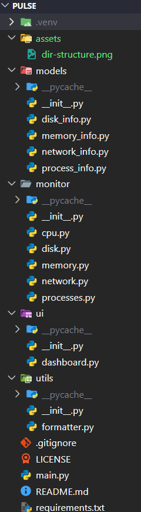

<h1 align="center">
  
</h1>

<p align="center"><i>Real-time system monitoring from your terminal.</i></p>

---

Pulse is a **terminal-based system monitoring dashboard built in Python**, designed to provide real-time insights into system performance through an interactive and visually organized interface.

The project focuses on **Python package management, operating system APIs, system resource monitoring, modular software architecture, terminal user interfaces, dataclasses, and real-time dashboard development**, while leveraging powerful third-party libraries to create a practical monitoring utility.

> Note: Pulse is a learning-focused systems programming project that continuously monitors key system metrics and presents them through a live-updating dashboard directly within the terminal.

<p align="center">
  
</p>

<p align="center">
  
  
  
</p>

<p align="center">
  
  
</p>

<p align="center">
  
</p>

## Features

1. ### CPU Monitoring

   * Displays current CPU utilization
   * Updates continuously in real time
   * Clean and readable terminal presentation
   * Built using operating system performance APIs

2. ### Memory Monitoring

   * Displays total memory capacity
   * Shows used and available memory
   * Reports memory utilization percentage
   * Live-updating statistics

3. ### Disk Monitoring

   * Displays total disk capacity
   * Tracks used and free storage
   * Reports disk usage percentage
   * Real-time storage information

4. ### Process Monitoring

   * Displays top running processes
   * Shows process IDs (PID)
   * Displays CPU consumption per process
   * Automatically updates process information

5. ### Network Monitoring

   * Tracks bytes sent and received
   * Displays overall network activity
   * Updates continuously alongside system metrics
   * Integrated into the dashboard interface

6. ### Live Dashboard Interface

   * Built using Rich layouts and panels
   * Real-time dashboard refresh
   * Structured terminal-based UI
   * Supports continuous monitoring sessions

## Project Architecture

<p align="center">
  
</p>

## Tech Stack

<div align="center">

| Component         | Technology   |
| ----------------- | ------------ |
| Language          | Python 3     |
| System Monitoring | psutil       |
| Terminal UI       | rich         |
| Data Models       | dataclasses  |
| Version Control   | Git + GitHub |

</div>

## Build & Run Instructions

### Requirements

* Python 3.10 or higher
* Git (for cloning the repository)

### Clone the Repository

```bash
git clone https://github.com/abhi-saurav-saroya/pulse.git
cd pulse
```

### Install Dependencies

```bash
pip install -r requirements.txt
```

### Run the Application

```bash
python main.py
```

or

```bash
python3 main.py
```

### Usage

1. Launch Pulse.
2. The dashboard will start automatically.
3. Monitor CPU, Memory, Disk, Network, and Process activity.
4. Watch metrics update in real time.
5. Press **Ctrl + C** to exit the dashboard.

<p align="center">
  
</p>

<div align="center">


<i>Built to learn, designed to monitor, engineered one heartbeat at a time. 💓</i>

<i>Pulse — Your System's Heartbeat.</i>

<p align="center">
  
</p>

**© 2026 Open Source Project | Pulse - Your System's Heartbeat | MIT License**

</div>
